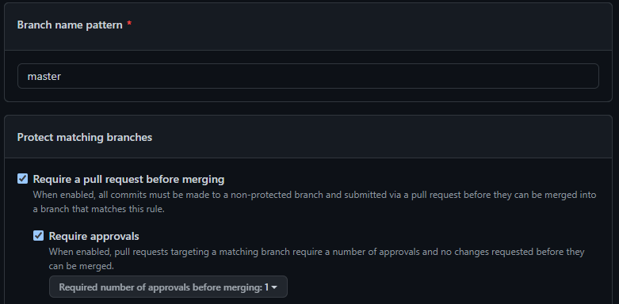
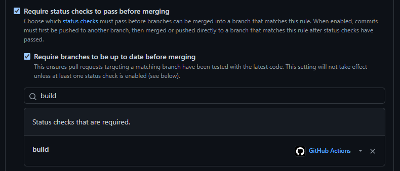

Final PGR301 Exam - Kandidatnummer: 1009

### Del 1 - DevOps prinsipper

### Del 2 - Continuous Integration
#### oppgave 3.
Det er dumt ifølge devops prinsipper å pushe kode direkte på main/master-branch. Derfor ønsker man å sette opp en 'Branch protection rule' som det heter. \
Desverre så sier github "Your rules won't be enforced on this private repository until move to a GitHub Team or Enterprise organization account". Uansett så skal jeg forklare deg hvordan man setter opp en slik regel.
1. Først gå på prosjektet på GitHub og inn i 'Settings'. 
2. Gå så på menyvalget 'Branches'. 
3. Der trykker man på 'Add branch protection rule'.
4. Da har man kommet seg hit. Under 'Branch name pattern' skal du legge inn main/master alt ettersom hva som er din hoved-branch.

5. Ved å huke av 'Require a pull request before merging' utelukker du muligheten til å pushe kode direkte på branchen skrevet inn ovenfor. I dette tilfellet master-branchen.
6. Ved å huke av 'Require approvals' og velge 'Require number of approvals before merging: 1' krever du at for å få kode til master-branch, er man nødt til å åpne en pull-request fra en annen ubeskyttet branch. Så få godkjent pull-requesten av 1 person før branchen kan bli merget med master-branch.
7. Scroll litt lenger ned og huk av 'Require status checks to pass before merging' og 'Require branches to be up to date before merging' og skriv inn 'build' og 'build_docker_image' i feltet.

8. Ved å gjøre dette krever man at for pull-requesten skal kunne merges i master-branch må statusene på begge jobbene nevnt ovenfor være er vellykkede, altså være verifisert av GitHub Actions.

### Del 3 - Docker
#### oppgave 1.
For å få worklfowen til å fungere med din DockerHub konto må du gjøre følgende:
1. For å få worklflowen til å fungere med din DockerHub konto må du først og fremst ha en DockerHub bruker. Da kan det være lurt å lagre DockerHub
   brukernavn og passord som en repository secret på GitHub. Under 'Settings', så 'Secrets' så 'Action', og legge til 2 'New repository secret'.
    1. DOCKER_HUB_USERNAME, med brukernavnet ditt.
    2. DOCKER_HUB_PASSWORD, med passordet ditt.  
       Så du vil trenge en login-action med de.

2. Så vil du vil trenge en metadata-action med en image-tag, som beskriver hvor containeren skal lagres remote, og tagen||navnet til containeren du skal pushe.\
   Som ville vært f.eks:   
   images: mitt-dockerhub-brukernavn/tag||navn-på-container.

3. Så vil man behøve en build-push-action med push-tag satt til true, slik at imaget vil bli pushet til dockerhub hvis bygget er suksessfullt.
   Man vil også trenge en tag opsjon, i formatet mitt-dockerhub-brukernavn/tag||navn-på-container-remote:versjon-av-image

Det er flere ting som er galt med denne workflowen.
Det som utgangspunktlig ble gjort på linje 22, hvor Jim bare skipper testene gjør at imaget ikke vil kompilere. Samtidig som han har satt push: true, under build-push-action. Noe som gjør at imaget ikke vil bli pushet hvis det er bygge-feil.
Jim har også konfigurert workflowen til å liksom finne ut hvor det remote repositoriet er via tags i build-push-action. Noe som ikke vil fungere. Du er nødt til å definere namespacet til hvor Docker skal pushe imaget ditt remote, for så å definere versjon i build-push-action senere. 
Det må gjøres som steg 2. ovenfor. Via en image tag, i metadata-action.
Det å definere hvilken versjon av JDK som skal brukes i workflowen er helt unødvendig. Det skal defineres i Dockerfile, så skal prosjektet så pakkes og bygges der, som workflowene så skal få bygge og runne på.

Beskriv hva du må gjøre for å få workflow til å fungere med din DockerHub konto? Hvorfor feiler workflowen?
#### oppgave 2.

#### oppgave 3.
For at sensor skal kunne laste opp container image til sitt eget ECR-repository må man skrifte verdi på variablen 'ecrrepositoryname'(linje 22 ish) i docker.yml til navnet til sensor sitt ECR-repo.
I tillegg må sensor autentisere seg ovenfor AWS, og er nødt til å legge til sin egen AWS access-og secret access Key på GitHub.Igjen, det kan man ved å gå på prosjektet på github, under 'Settings', så 'Secrets', så 'Actions' og 
legge til ny 'New repository secret' med verdiene sensor får fra AWS sitt IAM-system. Så skal det fungere for sensor:)

Det er et god devops prinsipp å ikke commite direkte på master-branch, derfor konfiguerer jeg jobben 'build_docker_image' til å kun kjøres ved pull requester til master branch. Dette fungerer godt i dette prosjektet
da jeg slutter med å pushe direkte på master, og heller lager en feature-branch som så skal pull-requestes inn i master når en feature er ferdig.
Feature-branchen vil fortsatt kjøre jobben 'build' som sjekker om tester kjøres og programmet kompileres hver gang det pushes til feature-branch, men man vil spare run-time minutter i AWS. Da feature-branch slipper
å kjøre 'build_docker_image' på hver eneste push, men kun når det pulles på master-branch.

Beskriv deretter med egne ord hva sensor må gjøre for å få sin fork til å laste opp container image til sitt eget ECR repo.

